
<h1 align="center">在线BLOG网</h1>

## 简介
在线BLOG网：系统基于Spring Boot开发，角色分为管理员和用户。提供博客管理、用户管理、博客标签和分类、论坛管理、相册信息管理等功能，实现内容发布、用户注册和密码修改等。    --计算机毕业设计源码；毕设源码；java毕业设计源码

## 联系方式

<h3 align="center">获取完整代码与数据库文件 + 微信：deepguan QQ: 86050149 QQ群: 783742310</h3>

<h3 align="center">可帮忙远程部署 包运行成功！提供远程部署、修改代码、设计文档指导、代码讲解等服务！</h3>

## 功能介绍（完整见运行截图）
管理员：基本功能包括登录、注册、退出，以及后台管理功能，如用户管理、博客管理、标签管理、分类管理、相册管理、论坛管理、系统设置等。管理员可以在各模块中进行添加、编辑、删除操作，并使用富文本编辑器编辑博客内容或论坛帖子，支持图片和文件上传。同时，还可以管理网站界面的轮播图、审核用户发布的帖子和评论，并调整网站的展示内容。

用户：基本功能包括登录、注册、退出，可通过前台界面访问博客、相册、论坛等模块。用户可以在自己的主页查看和发布博客文章、帖子，进行分类和标签管理，上传相关图片。还可参与评论、收藏文章，并在个人中心查看和修改个人信息，如密码更改，资料更新等，享受互动和内容分享功能。同时，用户能通过搜索快速查找特定博客或相册信息。

## 运行截图
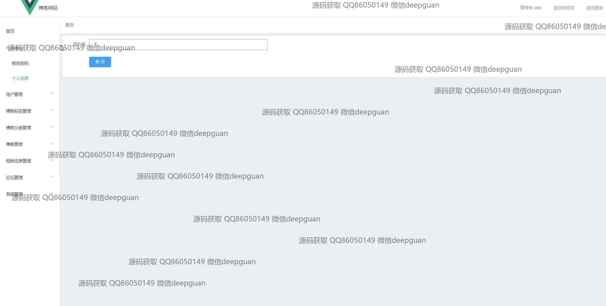

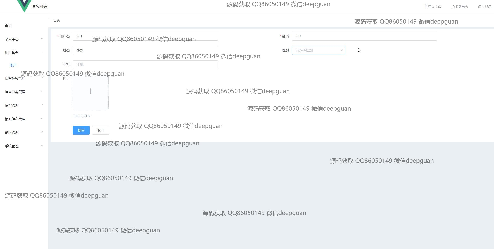
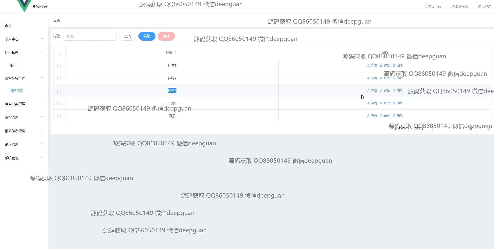
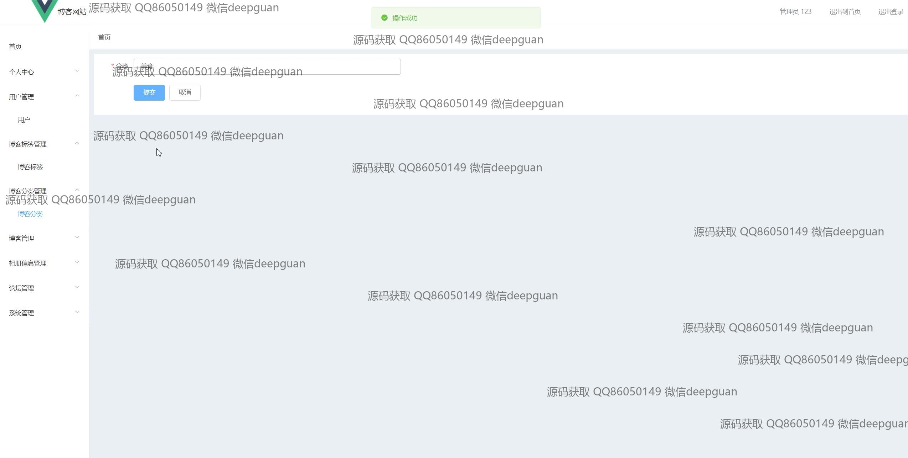
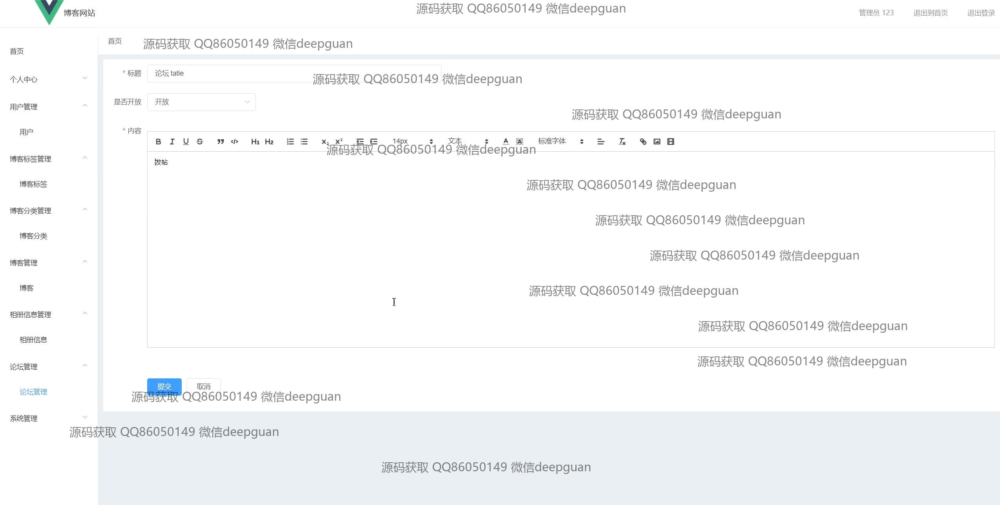
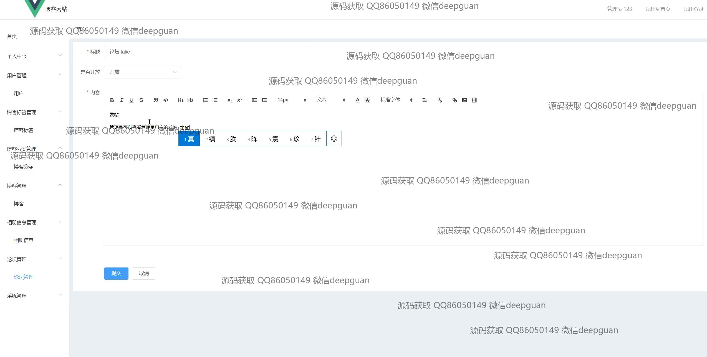
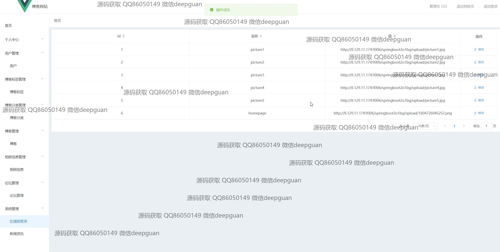
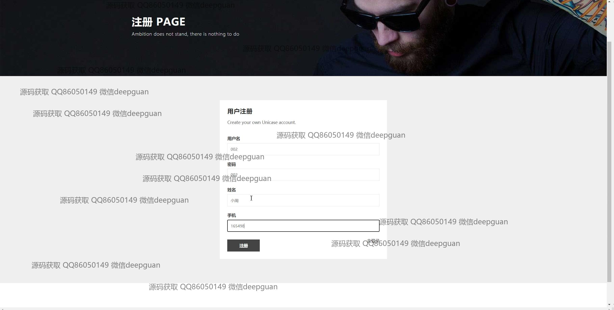
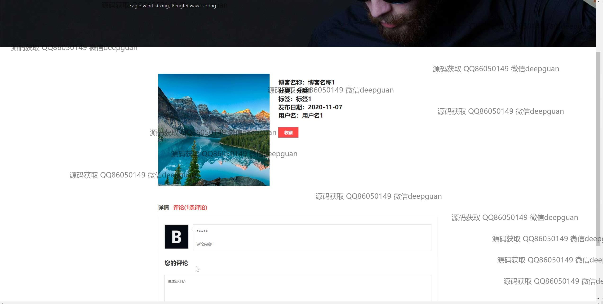
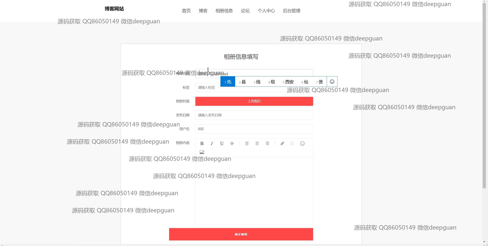
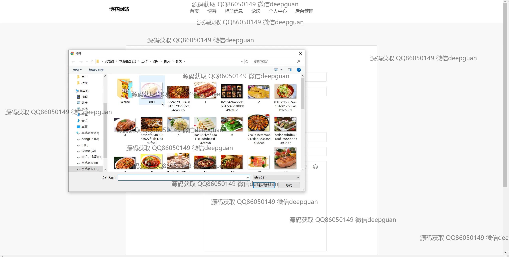

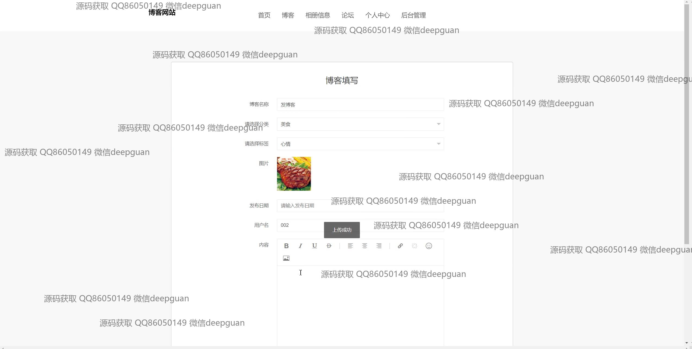

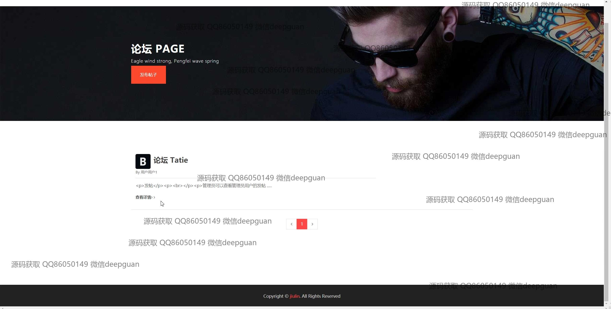
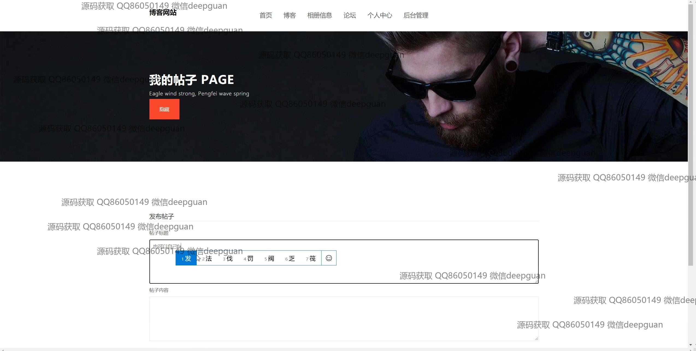
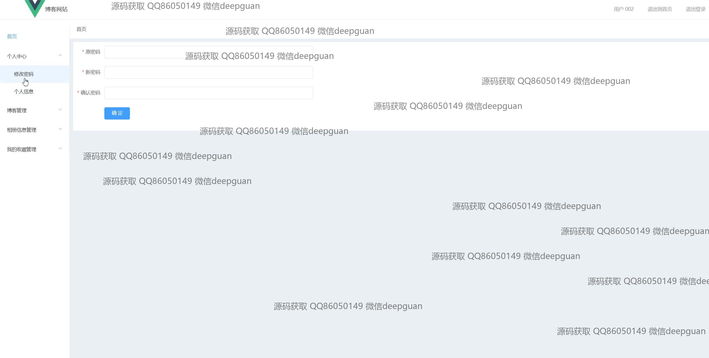

本代码来源于网络,仅供学习参考使用!

